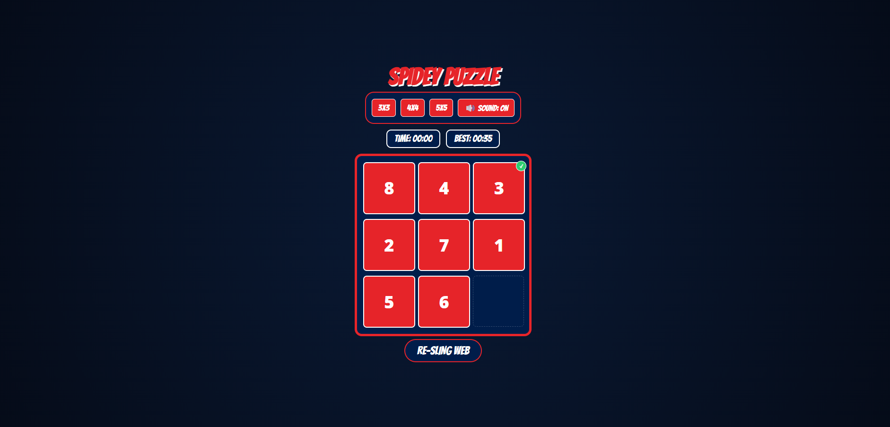

# 🕸️ Spidey Puzzle: Web-Slinger Edition

An interactive 8-puzzle game (and beyond) inspired by Spider-Man. Challenge your brain across multiple difficulty levels, track your best times, and enjoy custom "thwip" sound effects and webbing animations!

## 🚀 Play It Now
[(https://geosteam36.github.io/8-puzzle-game-Demo-/)]

## 🎮 How to Play
1. **Choose Your Mission:** Select between **Training (3x3)**, **Hero (4x4)**, or **Avenger (5x5)**.
2. **The Goal:** Arrange the numbered tiles in order from 1 to 8 (or 15/24) by sliding them into the empty space.
3. **Spider-Sense:** A green checkmark (✓) will appear on tiles that are in the correct position.
4. **Win:** Complete the puzzle to trigger the web-slinging victory animation!

## ✨ Features
* **Difficulty Scaling:** Dynamic grid sizes from 3x3 to 5x5.
* **Time Tracking:** Saves your personal best time for each level using `localStorage`.
* **Spidey HUD:** Built with a "comic-book" aesthetic using CSS animations and Google Fonts.
* **Audio FX:** Custom "thwip" sounds for every move (with a mute toggle).
* **Webbing Victory:** High-energy CSS animation upon mission completion.

## 🛠️ Built With
* **HTML5**
* **CSS3** (Custom Animations & Flexbox/Grid)
* **JavaScript** (Vanilla ES6)

## 📸 Preview

---
*Created with Spider-Sense and Code.*